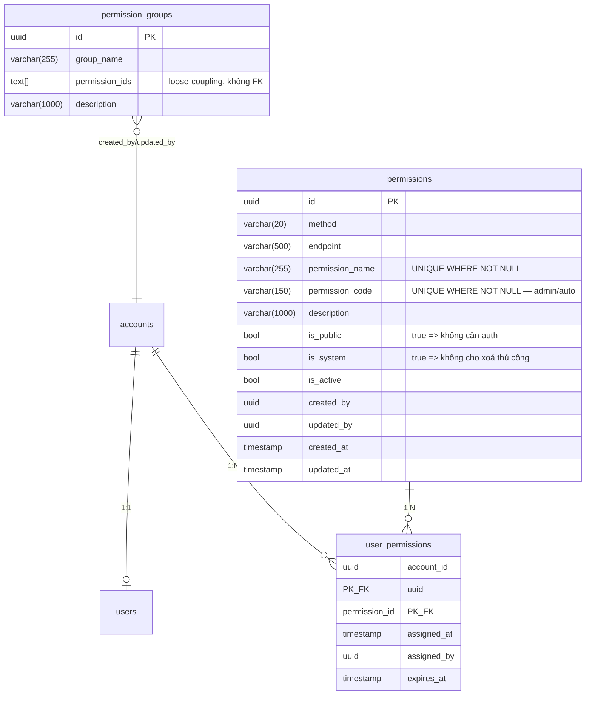
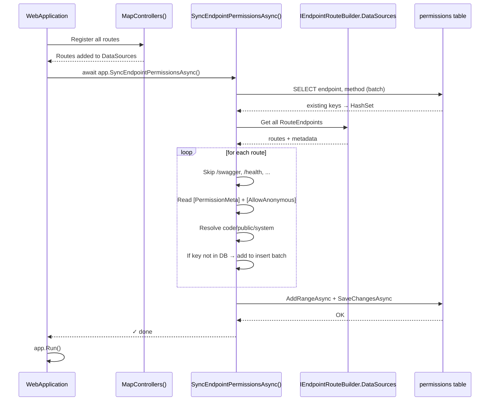

# Thiết Kế Dynamic Permission & Auto-Discovery

> Tài liệu mô tả thiết kế cơ chế phân quyền động trong hệ thống Modular Monolith
> (`AuthModule` + `MainModule`) và pipeline tự động quét API endpoints để đồng bộ
> vào bảng `permissions` khi ứng dụng khởi động.

---

## 1. Tổng Quan

### 1.1. Mục tiêu

- **Không hardcode permission**: tất cả endpoint đều được tự động ghi nhận vào DB ngay khi
  ứng dụng khởi động.
- **Admin có thể quản lý**: bổ sung/chỉnh `PermissionCode`, `PermissionName`, `Description`
  qua UI mà không bị ghi đè khi restart.
- **Multi-module**: nhiều module (`AuthModule`, `MainModule`, ...) cùng chia sẻ một bảng
  `permissions` duy nhất, mỗi module tự quét và đồng bộ phần endpoint của mình.
- **Annotation-driven**: developer dùng attribute `[PermissionMeta]` để khai báo metadata
  ngay tại controller/action — không phải sửa logic sync.

### 1.2. Các thành phần chính

| Thành phần | Vị trí | Vai trò |
|------------|--------|---------|
| `Permission` (entity) | `AuthModule/Dal/Entities/Permission.cs` | Bảng nguồn — sở hữu schema |
| `Permission` (entity mirror) | `MainModule/Dal/Entities/Permission.cs` | Mirror, chỉ read/write — không tạo migration |
| `PermissionMetaAttribute` | `*/Attributes/PermissionMetaAttribute.cs` | Annotation metadata trên controller/action |
| `PermissionSyncExtensions` | `*/Extensions/PermissionSyncExtensions.cs` | Extension method scan endpoint & sync DB |
| `Program.cs` | mỗi module | Wire up `app.SyncEndpointPermissionsAsync()` lúc startup |

---

## 2. Kiến Trúc Database

### 2.1. Mô hình RBAC (đơn giản hóa)



### 2.2. Bảng `permissions` — quy tắc

| Cột | Nguồn | Note |
|-----|-------|------|
| `id` | Sync tự sinh (`Guid.NewGuid()`) | |
| `method` | Auto từ `[HttpGet/Post/...]` | UPPERCASE |
| `endpoint` | Auto từ route pattern | normalize bắt đầu `/`, giữ nguyên `{id:guid}` |
| `permission_name` | **Admin nhập tay** sau | Sync luôn để `null` |
| `permission_code` | **3 nguồn** (xem §4.2) | `[Code = "..."]` > `AutoGenerateCode` > `null` |
| `description` | **Admin nhập tay** | Sync luôn để `null` |
| `is_public` | Attribute `Public` hoặc `[AllowAnonymous]` | |
| `is_system` | Attribute `IsSystem` | Default `false` |
| `is_active` | Sync set `true` | Admin có thể tắt |

### 2.3. Unique constraints (partial)

```sql
CREATE UNIQUE INDEX ix_permissions_permission_name
    ON permissions (permission_name) WHERE permission_name IS NOT NULL;

CREATE UNIQUE INDEX ix_permissions_permission_code
    ON permissions (permission_code) WHERE permission_code IS NOT NULL;
```

→ Nhiều row có thể cùng có `permission_code = NULL` (chưa được auto-gen / chưa nhập tay),
nhưng nếu đã nhập thì phải unique.

---

## 3. Multi-Module — Một DB, Một Bảng

### 3.1. Vấn đề

`AuthModule` và `MainModule` đều cần ghi xuống bảng `permissions` để tự đồng bộ endpoint
của module mình. Tuy nhiên:

- Schema của bảng do `AuthModule` quản lý (migration trong `AuthModule/Dal/Migrations/`).
- Nếu `MainModule` cũng có entity `Permission` mà không xử lý → khi chạy
  `dotnet ef migrations add` trong `MainModule` sẽ tạo migration trùng lặp / xung đột.

### 3.2. Giải pháp: `ExcludeFromMigrations()`

`MainModule` định nghĩa entity mirror nhưng **không** tham gia migration:

```csharp
// MainModule/Dal/Data/MainDbContext.cs
public DbSet<Permission> Permissions => Set<Permission>();

protected override void OnModelCreating(ModelBuilder modelBuilder)
{
    // Owned by AuthModule — MainModule chỉ query/insert, không alter schema
    modelBuilder.Entity<Permission>()
        .ToTable("permissions", t => t.ExcludeFromMigrations());

    // ... product config ...
}
```

→ `MainModule` có thể `INSERT/SELECT` vào bảng `permissions`, nhưng `dotnet ef migrations
add` trong `MainModule` sẽ **bỏ qua** bảng này hoàn toàn.

### 3.3. Quyền sở hữu

| Module | Quyền với `permissions` |
|--------|------------------------|
| `AuthModule` | Owner — define schema, migration, đọc/ghi |
| `MainModule` | Consumer — chỉ đọc/ghi qua `MainDbContext.Permissions` |

---

## 4. Annotation `[PermissionMeta]`

### 4.1. Định nghĩa

```csharp
[AttributeUsage(AttributeTargets.Class | AttributeTargets.Method,
                AllowMultiple = false, Inherited = true)]
public sealed class PermissionMetaAttribute : Attribute
{
    public bool       IsSystem        { get; set; } = false;
    public PublicMode Public          { get; set; } = PublicMode.Auto;
    public string?    Code            { get; set; } = null;
    public bool       AutoGenerateCode { get; set; } = false;
}

public enum PublicMode
{
    Auto    = 0,  // detect qua [AllowAnonymous]
    Public  = 1,  // force is_public = true
    Private = 2   // force is_public = false (kể cả khi có [AllowAnonymous])
}
```

### 4.2. Quy tắc resolve `permission_code`

Theo thứ tự ưu tiên:

```
[PermissionMeta(Code = "auth:login")]   →  "auth:login"           (explicit)
        ↓ (nếu không có)
[PermissionMeta(AutoGenerateCode=true)] →  generate từ route+verb (convention)
        ↓ (nếu không có)
                                        →  null                   (admin nhập tay sau)
```

### 4.3. Quy tắc resolve `is_public`

Theo thứ tự ưu tiên:

```
[PermissionMeta(Public = PublicMode.Public)]   → true
[PermissionMeta(Public = PublicMode.Private)]  → false
[PermissionMeta(Public = PublicMode.Auto)]     → kiểm tra [AllowAnonymous]
                                               → true nếu có, false nếu không
```

### 4.4. Quy tắc resolve `is_system`

Đơn giản: chỉ lấy từ `meta?.IsSystem ?? false`.

### 4.5. Class-level vs Method-level

- **Method-level** thắng **class-level** khi cùng có attribute.
- Kỹ thuật: dùng `endpoint.Metadata.GetOrderedMetadata<PermissionMetaAttribute>().LastOrDefault()`
  — class-level nằm trước, method-level nằm sau, `LastOrDefault()` lấy cái sau cùng.

---

## 5. Quy Ước Auto-Generate `PermissionCode`

### 5.1. Pattern

```
[resource]:[action][_suffix?]
```

### 5.2. Bảng quy đổi `method → action`

| HTTP Method | Có `{param}` trong route | Action |
|-------------|--------------------------|--------|
| `GET` | Không | `list` |
| `GET` | Có | `read` |
| `POST` | — | `create` |
| `PUT` | — | `update` |
| `PATCH` | — | `patch` |
| `DELETE` | — | `delete` |

### 5.3. Resource extraction

- Strip prefix `/api/`.
- `resource` = segment đầu tiên không phải template param (`{...}`).
- Trailing segments không-param (vd `stock` trong `/api/products/{id}/stock`) → ghép vào suffix
  với dấu `_`.
- Hyphen `-` → `_` để hợp pattern `[resource]:[action]`.

### 5.4. Ví dụ thực tế (từ `ProductsController`)

| Route | Method | Generated Code |
|-------|--------|----------------|
| `/api/products` | `GET` | `products:list` |
| `/api/products/{id:guid}` | `GET` | `products:read` |
| `/api/products` | `POST` | `products:create` |
| `/api/products/{id:guid}` | `PUT` | `products:update` |
| `/api/products/{id:guid}` | `DELETE` | `products:delete` |
| `/api/products/{id:guid}/stock` | `PATCH` | `products:patch_stock` |

---

## 6. Pipeline Auto-Discovery (Sync)

### 6.1. Sequence diagram



### 6.2. Các bước chi tiết

#### Bước 1 — Batch-load existing keys

```csharp
var existing = await db.Permissions
    .AsNoTracking()
    .Where(p => p.Endpoint != null && p.Method != null)
    .Select(p => new { p.Endpoint, p.Method })
    .ToListAsync();

var existingSet = existing
    .Select(p => BuildKey(p.Endpoint!, p.Method!))
    .ToHashSet(StringComparer.OrdinalIgnoreCase);
```

→ **1 query duy nhất** thay vì N queries trong loop. Key format: `"METHOD:/lower/path"`.

#### Bước 2 — Lấy đúng EndpointDataSource

> **Bẫy lớn**: `scope.ServiceProvider.GetRequiredService<EndpointDataSource>()` trả về
> một instance **rỗng** — không phải composite source mà `MapControllers()` đã add routes vào.

Phải cast `WebApplication` thành `IEndpointRouteBuilder`:

```csharp
var routeBuilder = (IEndpointRouteBuilder)app;
var allEndpoints = routeBuilder.DataSources.SelectMany(ds => ds.Endpoints);
```

#### Bước 3 — Loop & resolve metadata

```csharp
foreach (var endpoint in allEndpoints)
{
    if (endpoint is not RouteEndpoint routeEndpoint) continue;

    var rawPattern = routeEndpoint.RoutePattern.RawText;
    if (string.IsNullOrWhiteSpace(rawPattern)) continue;

    var normalizedPath = rawPattern.StartsWith('/') ? rawPattern : "/" + rawPattern;
    if (ShouldSkip(normalizedPath)) continue;   // /swagger, /health, /openapi, /favicon, /_

    var httpMethods = endpoint.Metadata.GetMetadata<HttpMethodMetadata>()?.HttpMethods;
    if (httpMethods is null || httpMethods.Count == 0) continue;

    // method-level đè class-level
    var meta = endpoint.Metadata
        .GetOrderedMetadata<PermissionMetaAttribute>()
        .LastOrDefault();

    var isSystem = meta?.IsSystem ?? false;
    var isPublic = meta?.Public switch
    {
        PublicMode.Public  => true,
        PublicMode.Private => false,
        _                  => endpoint.Metadata.GetMetadata<IAllowAnonymous>() is not null
    };

    foreach (var method in httpMethods)
    {
        var key = BuildKey(normalizedPath, method);
        if (!existingSet.Add(key)) continue;   // tồn tại trong DB hoặc trùng trong batch

        toInsert.Add(new Permission
        {
            Id              = Guid.NewGuid(),
            Endpoint        = normalizedPath,
            Method          = method.ToUpperInvariant(),
            IsPublic        = isPublic,
            IsSystem        = isSystem,
            IsActive        = true,
            PermissionCode  = meta?.Code
                            ?? (meta?.AutoGenerateCode == true
                                ? GeneratePermissionCode(normalizedPath, method)
                                : null),
            PermissionName  = null,    // admin nhập tay
            Description     = null,    // admin nhập tay
            CreatedAt       = DateTime.UtcNow
        });
    }
}
```

#### Bước 4 — Bulk insert

```csharp
if (toInsert.Count == 0)
{
    logger.LogInformation("[PermissionSync] No new endpoints to sync.");
    return;
}

await db.Permissions.AddRangeAsync(toInsert);
await db.SaveChangesAsync();

logger.LogInformation("[PermissionSync] Synced {Count} new endpoint(s).", toInsert.Count);
```

### 6.3. Idempotency — Vì sao không ghi đè?

Sync **chỉ INSERT** những row chưa tồn tại (matched bằng `Method + Endpoint`).
Row cũ luôn được giữ nguyên → admin nhập `PermissionCode`, `PermissionName`, `Description`
sẽ không bị mất khi restart app.

```
Restart → SELECT existing → HashSet
        → Compare từng route → CHỈ insert những cái mới
        → Row cũ tuyệt đối không bị UPDATE/DELETE
```

### 6.4. Endpoint hệ thống bị skip

```csharp
private static readonly string[] SkippedPrefixes =
    ["/swagger", "/openapi", "/health", "/favicon", "/_"];
```
---

## 9. Bảng Truy Vết (Decision Matrix)

### 9.1. `is_public` được tính như thế nào?

| `[PermissionMeta]`?  | `Public = ?` | `[AllowAnonymous]`? | Kết quả `is_public` |
|----------------------|--------------|---------------------|---------------------|
| Không có | — | Có | `true` |
| Không có | — | Không | `false` |
| Có | `Auto` | Có | `true` |
| Có | `Auto` | Không | `false` |
| Có | `Public` | bất kỳ | `true` |
| Có | `Private` | bất kỳ | `false` |

### 9.2. `permission_code` được tính như thế nào?

| `Code` | `AutoGenerateCode` | Kết quả |
|--------|-------------------|---------|
| `"x:y"` | bất kỳ | `"x:y"` |
| `null` | `true` | Generate từ route + method |
| `null` | `false` | `null` |

### 9.3. `is_system` được tính như thế nào?

| `[PermissionMeta]`? | `IsSystem` | Kết quả |
|---------------------|------------|---------|
| Không có | — | `false` |
| Có | `false` (default) | `false` |
| Có | `true` | `true` |

---

## 10. Lifecycle & Vận Hành

### 10.1. Lần đầu deploy

1. AuthModule chạy migration → tạo bảng `permissions`.
2. AuthModule khởi động → sync các endpoint của AuthModule.
3. MainModule khởi động → sync các endpoint của MainModule (cùng bảng).

### 10.2. Thêm endpoint mới

1. Developer thêm action + `[PermissionMeta]`.
2. Restart module → sync tự động insert row mới.
3. Admin vào UI gán `permission_name`, `description` (nếu chưa có code → set code).

### 10.3. Xoá endpoint khỏi code

→ Row vẫn còn trong DB (sync không bao giờ xoá). Admin set `is_active = false`
hoặc xoá thủ công nếu `is_system = false`.

### 10.4. Đổi route/method

→ Sync coi đây là endpoint mới (vì key `METHOD:/path` khác). Row cũ vẫn còn.
Admin nên dọn thủ công hoặc viết script clean-up.
